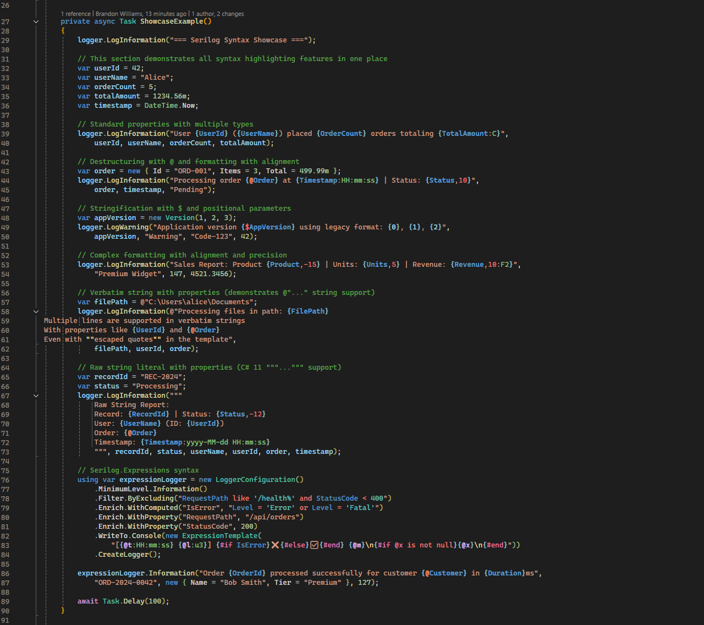

# Serilog Syntax Highlighting for Visual Studio

A Visual Studio 2022 extension that provides syntax highlighting, brace matching, and navigation features for Serilog message templates and Serilog.Expressions in C#/.NET projects.



## Features

### 🎨 Syntax Highlighting

#### Message Templates
- **Property names** highlighted in blue: `{UserId}`, `{UserName}`
- **Destructuring operator** `@` highlighted in dark goldenrod: `{@User}`
- **Stringification operator** `$` highlighted in dark goldenrod: `{$Settings}`
- **Format specifiers** highlighted in teal: `{Timestamp:yyyy-MM-dd}`
- **Alignment** highlighted in red: `{Name,10}`, `{Price,-8}`
- **Positional parameters** highlighted in dark violet: `{0}`, `{1}`
- **Property braces** highlighted in purple for structure
- **Multi-line verbatim strings** fully supported with proper highlighting across lines
- **C# 11 raw string literals** supported with `"""` delimiters for complex templates

#### Serilog.Expressions
- **Filter expressions** in `Filter.ByExcluding()` and `Filter.ByIncludingOnly()`
- **Expression templates** with control flow directives
- **Operators** highlighted distinctly: `and`, `or`, `not`, `like`, `in`, `is null`
- **Functions** highlighted: `StartsWith()`, `Contains()`, `Length()`, etc.
- **Literals** properly colored: strings, numbers, booleans, null
- **Directives** highlighted: `{#if}`, `{#each}`, `{#else}`, `{#end}`
- **Built-in properties**: `@t`, `@m`, `@l`, `@x`, `@i`, `@p`

### 🔗 Smart Detection
- Works with any logger variable name (not just `_logger` or `log`)
- Supports both direct Serilog calls: `Log.Information(...)`
- Supports Microsoft.Extensions.Logging integration: `_logger.LogInformation(...)`
- Supports `BeginScope` for scoped logging: `logger.BeginScope("Operation={Id}", operationId)`
- Supports `LogError` with exception parameter: `logger.LogError(ex, "Error: {Message}", msg)`
- Recognizes configuration templates: `outputTemplate: "[{Timestamp:HH:mm:ss}...]"`

### ⚡ Real-time Highlighting
- Immediate visual feedback as you type
- Highlighting appears as soon as you close braces `}` (doesn't wait for closing quotes)
- Supports incomplete strings during editing

### 🧭 Navigation Features
- **Light bulb suggestions** when hovering over template properties
- **Navigate to argument** - jump from template properties to their corresponding arguments
- Click the light bulb and select "Navigate to 'PropertyName' argument"

### 🔍 Brace Matching
- Highlight matching braces when cursor is positioned on `{` or `}`
- Visual indication of brace pairs in complex templates
- **Multi-line support** - matches braces across line boundaries in verbatim and raw strings
- Press **ESC** to temporarily dismiss highlights
- Helps identify mismatched or nested braces

## Installation

### From Visual Studio Marketplace (Recommended)
1. Install directly from the [Visual Studio Marketplace](https://marketplace.visualstudio.com/items?itemName=mtlog.SerilogSyntax)
2. Or from within Visual Studio 2022:
   - Go to **Extensions** > **Manage Extensions**
   - Search for "Serilog Syntax Highlighting"
   - Click **Download** and restart Visual Studio

### From GitHub Release
1. Download the latest `.vsix` file from the [releases page](../../releases)
2. Double-click the `.vsix` file to install in Visual Studio 2022
3. Restart Visual Studio

## Customization

### Color Customization
The extension's colors can be customized to match your preferences:

1. Go to **Tools** > **Options** > **Environment** > **Fonts and Colors**
2. In the **Display items** list, look for:
   - Serilog Property Name
   - Serilog Destructure Operator (@)
   - Serilog Stringify Operator ($)
   - Serilog Format Specifier
   - Serilog Alignment
   - Serilog Positional Index
   - Serilog Property Brace
3. Select any item and modify its **Item foreground** color
4. Click **OK** to apply changes

The extension uses colors that work well in both light and dark themes by default, meeting WCAG AA accessibility standards.

## Getting Started

After installation, the extension works automatically - no configuration required!

1. **Open any C# file** that uses Serilog logging
2. **Start typing** a Serilog log statement:
   ```csharp
   _logger.LogInformation("User {UserId} logged in", userId);
   ```
3. **See instant highlighting** as you type - properties turn blue, operators yellow, etc.
4. **Try navigation**: Hover over a property like `{UserId}` and click the light bulb to jump to its argument
5. **Test brace matching**: Place your cursor on any `{` or `}` to see its matching pair highlighted

### Quick Test
Create a new C# file and paste this to see all features:
```csharp
using Serilog;

Log.Information("User {UserId} logged in with {@Details} at {Timestamp:HH:mm:ss}", 
    userId, userDetails, DateTime.Now);
```

You should see:
- `UserId` in blue
- `@` in dark goldenrod, `Details` in blue  
- `Timestamp` in blue, `:HH:mm:ss` in teal
- Matching braces highlighted in purple when cursor is on them

## Supported Serilog Syntax

The extension recognizes and highlights all Serilog message template features:

```csharp
// Basic properties
logger.LogInformation("User {UserId} logged in at {LoginTime}", userId, loginTime);

// Destructuring (captures object structure)
logger.LogInformation("Processing user {@User}", user);

// Stringification (forces string representation)  
logger.LogInformation("Configuration loaded {$Settings}", settings);

// Format specifiers
logger.LogInformation("Current time: {Timestamp:yyyy-MM-dd HH:mm:ss}", DateTime.Now);

// Alignment
logger.LogInformation("Item: {Name,10} | Price: {Price,8:C}", name, price);

// Positional parameters (legacy support)
logger.LogWarning("Error {0} occurred in {1}", errorCode, methodName);

// Multi-line verbatim strings
logger.LogInformation(@"Processing report:
    User: {UserName}
    Department: {Department}
    Generated: {Timestamp:yyyy-MM-dd}", userName, dept, DateTime.Now);

// C# 11 raw string literals (no escaping needed for quotes)
logger.LogInformation("""
    Processing record:
    ID: {RecordId}
    Status: {Status}
    User: {@User}
    """, recordId, status, user);

// Configuration templates
Log.Logger = new LoggerConfiguration()
    .WriteTo.Console(outputTemplate: "[{Timestamp:HH:mm:ss} {Level:u3}] {Message:lj}")
    .CreateLogger();

// Serilog.Expressions filter syntax
Log.Logger = new LoggerConfiguration()
    .Filter.ByExcluding("RequestPath like '/health%'")
    .Filter.ByIncludingOnly("Level = 'Error' or StatusCode >= 500")
    .CreateLogger();

// Expression templates with control flow
var expressionTemplate = new ExpressionTemplate(
    "{#if Level = 'Error'}❌{#else}✅{#end} {@m}");

// Computed properties with expressions
.Enrich.WithComputed("ResponseTime", "EndsWith(RequestPath, '.json') ? Elapsed * 2 : Elapsed")
```

## Example Project

The solution includes a complete example project (`Example/`) that demonstrates all syntax highlighting features:

```bash
cd Example
dotnet run
```

Open `Example/Program.cs` in Visual Studio to see the extension in action with comprehensive examples of every supported syntax feature.

## Supported Logger Names

The extension automatically detects Serilog calls regardless of how you name your logger variables:

```csharp
// All of these work automatically
_logger.LogInformation("Message with {Property}", value);
logger.LogDebug("Debug message with {Data}", data);  
myCustomLogger.LogWarning("Warning with {Details}", details);
log.LogError("Error with {Context}", context);
```

## Development

### Prerequisites
- Visual Studio 2022 (17.0 or later)
- Visual Studio SDK
- .NET Framework 4.7.2

### Building
```bash
# Build the extension
.\build.ps1

# Run tests  
.\test.ps1

# The built .vsix file will be in SerilogSyntax\bin\Debug\
```

### Architecture

The extension uses Visual Studio's extensibility APIs:

- **Roslyn Classification API** - For syntax highlighting via `IClassifier`
- **Roslyn Tagging API** - For brace matching via `ITagger<TextMarkerTag>`  
- **Suggested Actions API** - For navigation features via `ISuggestedActionsSourceProvider`
- **MEF (Managed Extensibility Framework)** - For Visual Studio integration

Key components:
- `SerilogClassifier` - Handles syntax highlighting with smart cache invalidation
- `SerilogBraceMatcher` - Provides brace matching
- `SerilogNavigationProvider` - Enables property-to-argument navigation
- `SerilogCallDetector` - Optimized Serilog call detection with pre-check optimization
- `TemplateParser` - Parses Serilog message templates
- `LruCache` - Thread-safe LRU cache providing 268x-510x performance improvement

## Contributing

1. Fork the repository
2. Create a feature branch
3. Make your changes
4. Add tests for new features
5. Run the test suite: `.\test.ps1`
6. Submit a pull request

## License

This project is licensed under the MIT License - see the [LICENSE](LICENSE.txt) file for details.
